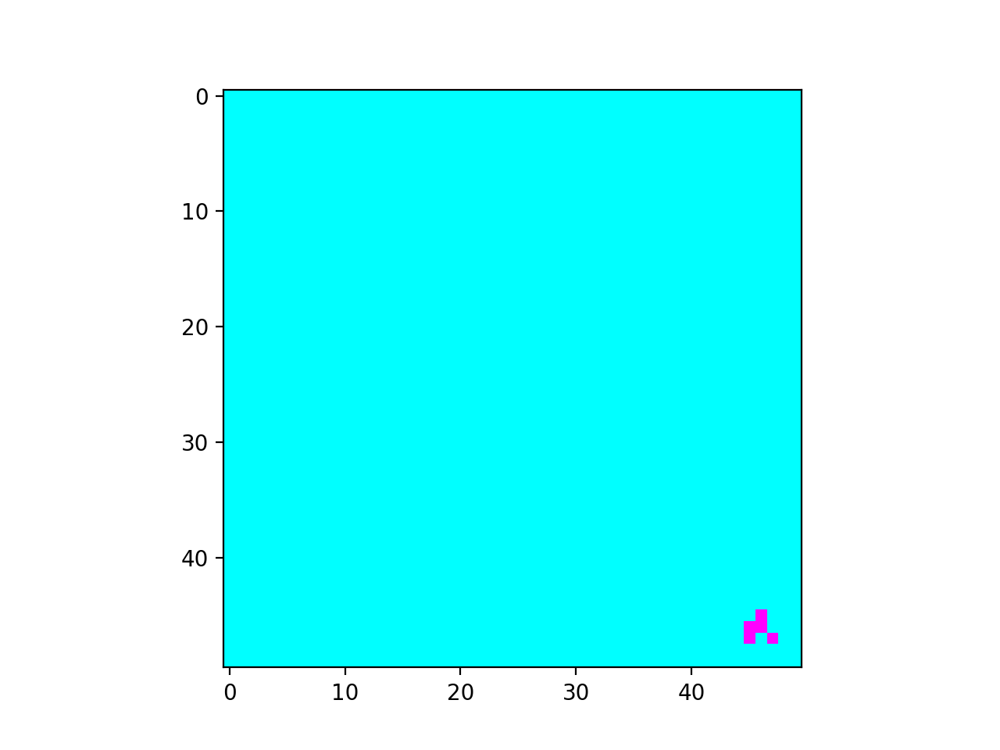
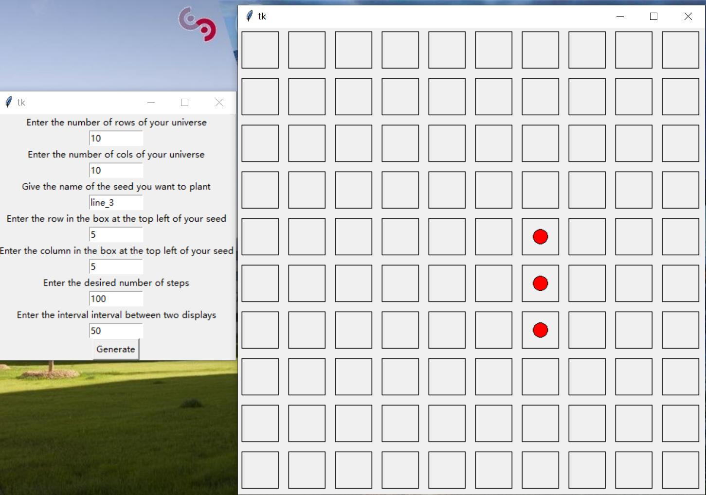

This project is the Game of Life project for the first week of CentraleSupelec Coding Weeks.

Members (Alphabetically ordered)
===================================
- Chensheng Luo (délégué)
- Haonan Lin
- Mingshan Ye
- Raven Bast
- Yue Yang Oo

Usages  
====================================
By Command-line Interface 
------------------------------------
Input 'python gameoflife.py [-h] [-c cmap] [-g n_generations] [-i interval] [-s] [-w writer] uY uX s sY sX' into the terminal.  

Example :  
''' python gameoflife.py -c cool -g 100 -i 100 -s 50 50 planeur 45 45 '''  

You will get:  
 

By Graphical Interface    
------------------------------------
Input 'python graphical_gameoflife.py' and play with it.  

You will get the following interface: 
  

List Of Files
====================================
Main Files
------------------------------------
- graphical_gameoflife.py : Input "python graphical_gameoflife.py" to run the GUI of the game.  
- gameoflife.py : Input "python gameoflife.py -h" for a list of arguments for game set-up from command-line interface.  

Saved GIFs Directory
------------------------------------
- ./gif/ : Generated GIFs are stored here if save is set to True.  

Support Files
------------------------------------
- generate_universe.py : Includes functions to generate universe, create seed and add seed to universe.  
- simulation.py : Includes functions to check cell survivability and generate over any number of iterations.  
- animation.py : Includes functions to animate the game with an option to save the gif in the default folder << ./gif/ >>.  

Test Files
------------------------------------
- test_generate_universe.py  
- test_simulation.py  
- test_animation.py  

Description Files
-------------------------------------
- ReadMe.md : Provides details on group members, usages, files and development timeline.
- to_do.md : List possible functionalities to be added in the future.  

Development Log
====================================
**Day 4**  
    Add new function by each one in its own branch  
**Day 3 Afternoon**  
    Function finished: Function 13: Graphic User Interface  
    Object 2 finished  
**Day 3 Morning**  
    Function finished: Fonction 10: Program   
    Object 1 finished    
**Day 2**  
    Function finished: Function 8: Visualisation and animation of game of life  
**Day 1**  
    Function finished: Function 1: Representation of universe and add a seed